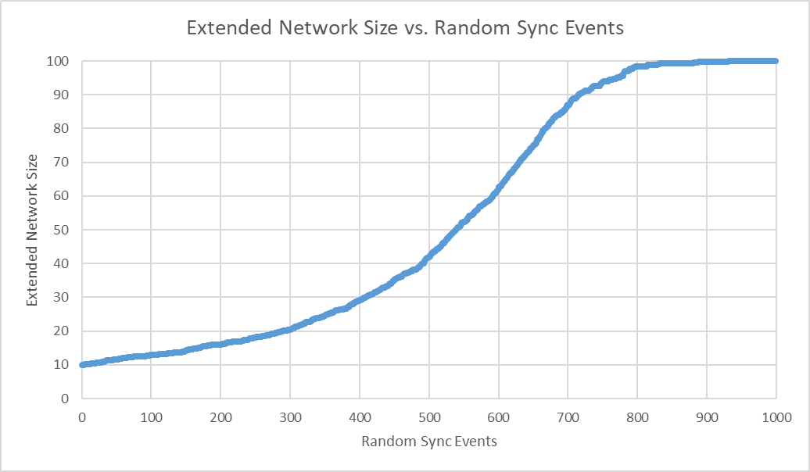

# jr

jr is a distributed, peer-to-peer social communication platform modeled after
[Secure Scuttle Butt](https://github.com/ssbc).

## Network

### Identity

All users on the jr network have an ed25519 keypair. They use their public key
as their identity and their private key is used to sign their messages.

### Following Network

Users maintain a set of public keys that they would like to follow. When a user
decides to follow a key they announce it publically by creating a `following` message.

### Extended Network

Users maintain a set of their `extended network`. These are the public keys they
are following *as well as* the public keys of who their `following network` is
following. 

### Messages

Each user maintains a list of messages that they have discovered or created.
The process of syncing is simply exchanging messages sent by users in either
parties `extended network`. Users may *carry* messages by people they aren't
following, but the assumption is that people who follow those users may be
interested in them.

At a minimum, all messages have a public key, signature, and timestamp. The
following message types are currently being used:

#### Following

#### Text

## Simulations

### Testing the Extended Network Functionality

This is our initial setup with private keys replaced with nil and public keys
replaced with the names Alice, Bob, and Carol.

```clojure
({:public "Alice",
  :private nil,
  :messages #{},
  :following #{},
  :extended #{}}

 {:public "Bob",
  :private nil,
  :messages #{},
  :following #{},
  :extended #{}}

 {:public "Carol",
  :private nil,
  :messages #{},
  :following #{},
  :extended #{}})
```

As you can see everyone has an empty message set, is not following anyone,
and does not have anyone in their extended network.

Alice decides to follow Bob and Bob decides the follow Carol. This leaves us
with the following network state:

```clojure
({:public "Alice",
  :private nil,
  :messages
  #{{:signature nil,
     :public "Alice",
     :following "Bob",
     :timestamp 1576107325835}},
  :following #{"Bob"},
  :extended #{"Bob"}}

 {:public "Bob",
  :private nil,
  :messages
  #{{:signature nil,
     :public "Bob",
     :following "Carol",
     :timestamp 1576107325846}},
  :following #{"Carol"},
  :extended #{"Carol"}}

 {:public "Carol",
  :private nil,
  :messages #{},
  :following #{},
  :extended #{}})
```

As you can see Bob is now in Alice's `following network` and her
`extended network` Alice has created a message saying she is following Bob so
that when people sync with her they can build their own `extended network` and
collect messages for the "friends of their friends."

Carol is now in Bob's `following network` and `extended network`. He has also
created a message saying he is following Carol.

Now to test the functionality of the `extended network` lets have Alice sync
with Bob.

```clojure
({:public "Alice",
  :private nil,
  :messages
  #{{:signature nil,
     :public "Bob",
     :following "Carol",
     :timestamp 1576107325846}
    {:signature nil,
     :public "Alice",
     :following "Bob",
     :timestamp 1576107325835}},
  :following #{"Bob"},
  :extended #{"Carol" "Bob"}}

 {:public "Bob",
  :private nil,
  :messages
  #{{:signature nil,
     :public "Bob",
     :following "Carol",
     :timestamp 1576107325846}},
  :following #{"Carol"},
  :extended #{"Carol"}}

 {:public "Carol",
  :private nil,
  :messages #{},
  :following #{},
  :extended #{}})
```

Alice now has two messages: a following message she created and Bob's message
saying he was following Carol. By going through her messages, Alice was able
to update her `extended network` to include Carol.

### Time to Build the Extended Network

`sim/net-bootstrap n f` will create a network of n nodes each following f random
nodes. Using this we can build a network of 100 nodes, each following 10 others
and use `sim/print-stats` to see how it was set up.

```clojure
jr.core=> (def nodes (sim/net-boostrap 100 10))
#'jr.core/nodes
jr.core=> (sim/print-stats nodes)
=== 100 nodes ===
Averages
  :following 10.00
  :extended  10.00
  :messages  10.00
nil
```

As expected, the extended network is limited to only nodes that a node is
following. Nodes build their following network by finding out about followers
in messages that they sync. `sim/rand-sync` will pick two nodes at random and
have them sync with eachother. We can use it to watch how the average extended
network grows as we randomly sync nodes. For our purposes
`core/extended-propagation-test` does exactly that, outputing the average size
of an extended network to "output.csv" for every iteration:

```clojure
(defn extended-propagation-test
  "Determines how many random iterations it takes to set up the extended
  network."
  []
  (def nodes (sim/net-bootstrap 100 10))
  (with-open [writer (io/writer "output.csv")]
    (csv/write-csv writer
      (map vector
        (range 1000) 
        (map #(float (sim/avg-key % :extended))
             (take 1000 (iterate sim/rand-sync nodes)))))))
```

Running it and graphing the output yields:



## Namesake

